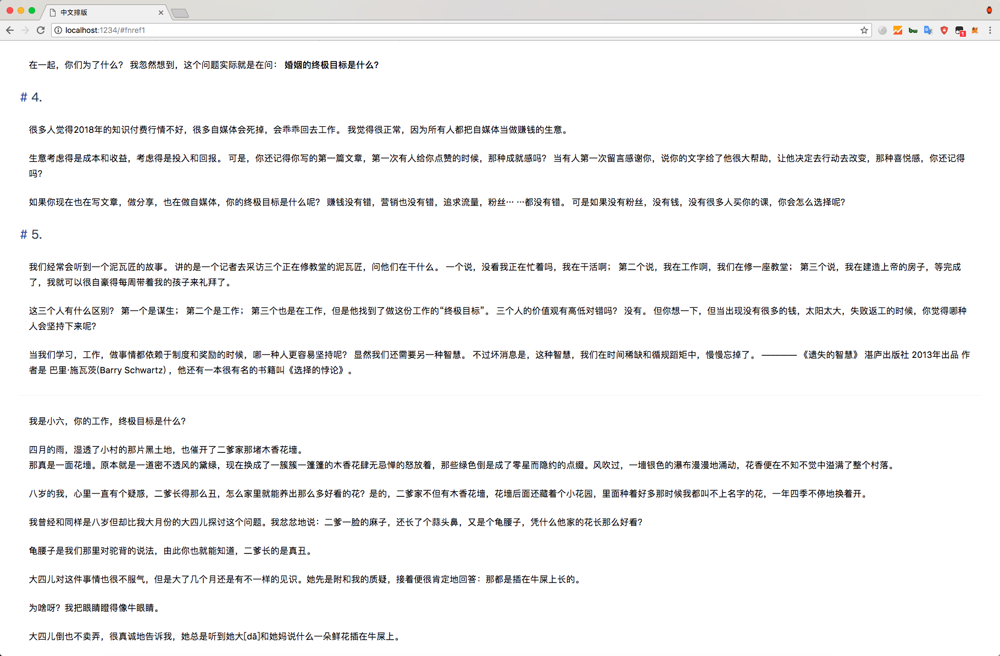
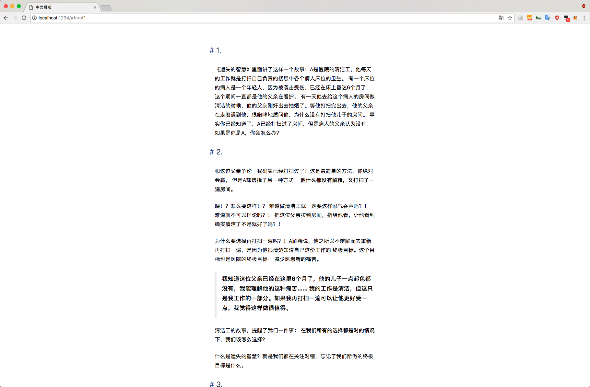
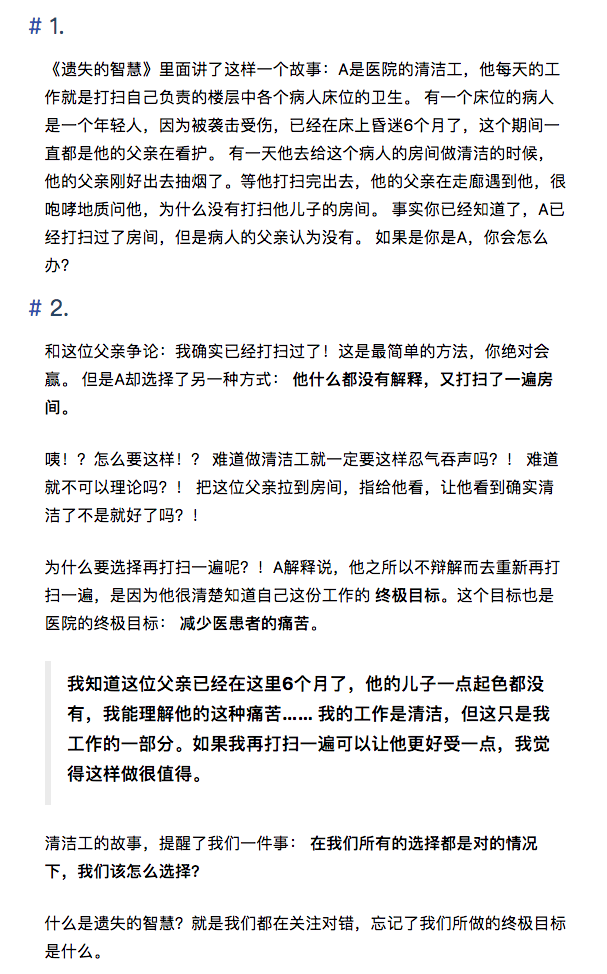
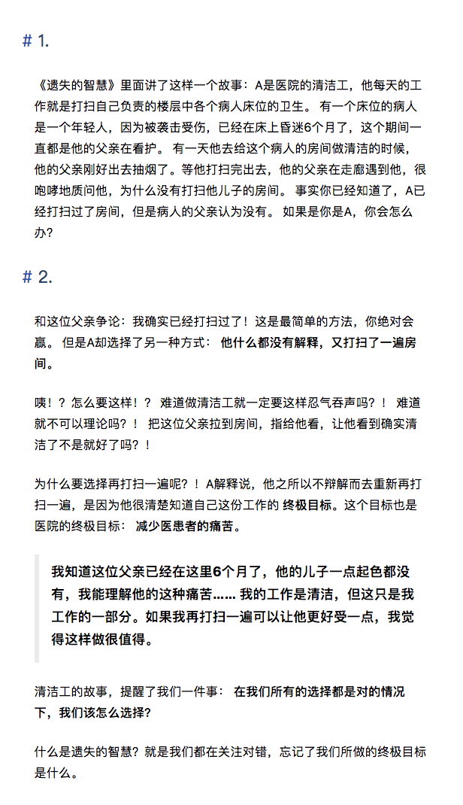
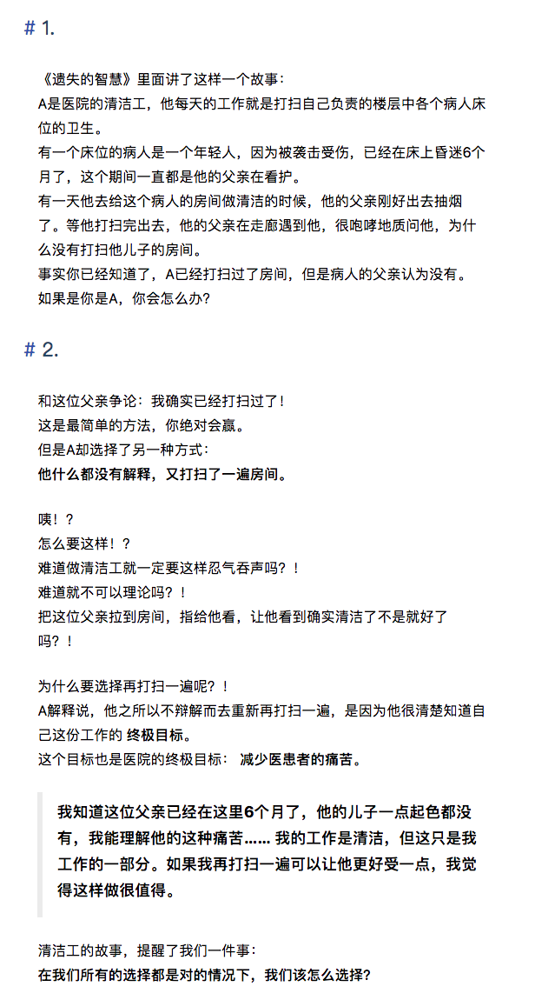
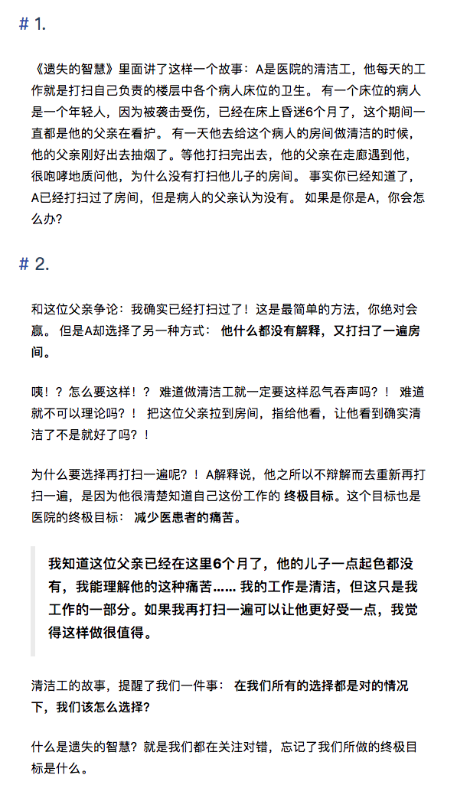

# Better-CN-Reading

为更美好的阅读体验，需要做到以下几点。

## 限定宽度

为了更多的折行，这样可以让文章内容看起来充实，这也是为什么微信 Web 端会限定宽度、简书文章会限定宽度。





## 标题大胆的留白

对于标题的留白我总是小心翼翼，其实 Web 端最不缺的就是屏幕，没必要，留白显得宽敞舒适。以及 1.7 左右的行高，段落之间明显的间距。





## 干掉 Br

有一些是由于写文章的时候编辑器造成的，有的部分作者不会断句。从懒人心理学的角度，每移动一次目光其实都会需要时间，特别看着断断续续的文字，会很累，而且空白留的不整齐，不如直接干掉。





## 使用

上面的只是理论，你也可以自己写一份样式，或者使用我写的。下载 `better-cn-reading.css`，引入、并添加 `class` 为 `reading`。

```html
<link rel="stylesheet" href="./better-cn-reading.css">
<div class="reading"></div>
```
